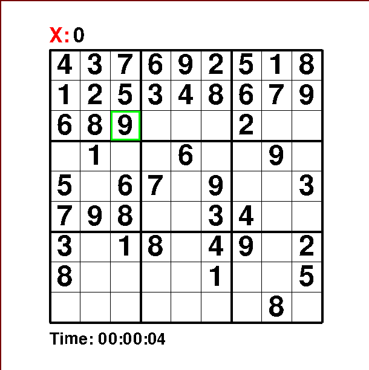

<h1> Sudoku + Solver In Pygame </h1> 

 This repository contains Sudoku + Solver written in Python using pygame module. 

 

  

<h2> Install </h2>
<ol>
  <li> Make sure you have pip and python installed </li>
  <li> Clone this repo </li>
  <li> run pip install -r requirements.txt in your terminal/cmd </li>
  <li> run python main.py in your terminal/cmd </li>
</ol>
<h3> Instructions </h3>
<ol>
  <li> Use arrow keys or mouse to navigate through grid </li>
  <li> Put a digit in a square by pressing it on the keyboard </li>
  <li> Submit your digit by pressing enter </li>
  <li> If you can't solve sudoku run solver by pressing space </li>
  <li> If you need more grids then use fetch_sudoku.py to get more grids </li>
  <li> Grids are stored in sudoku.txt </li>  
</ol>
